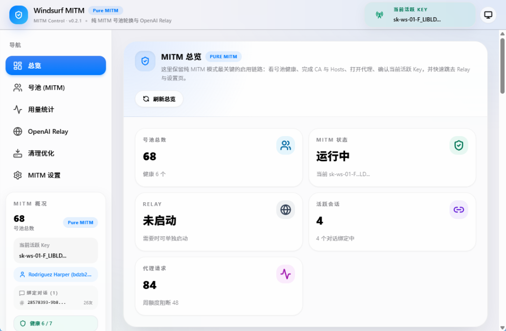
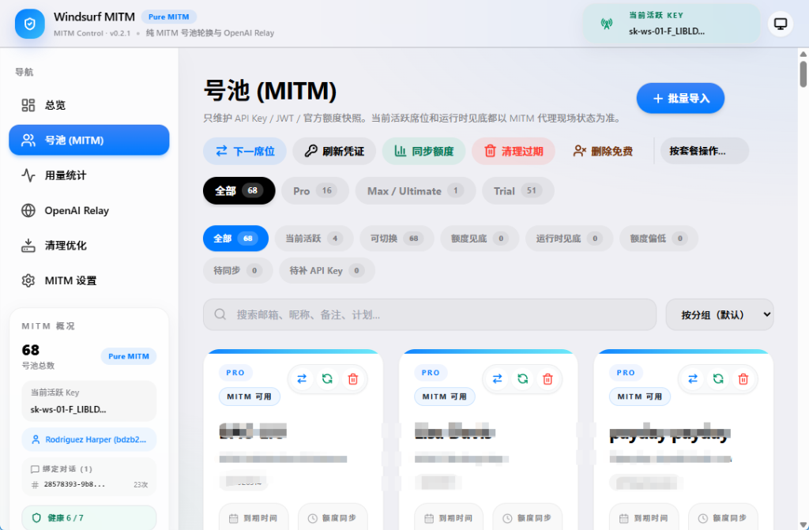
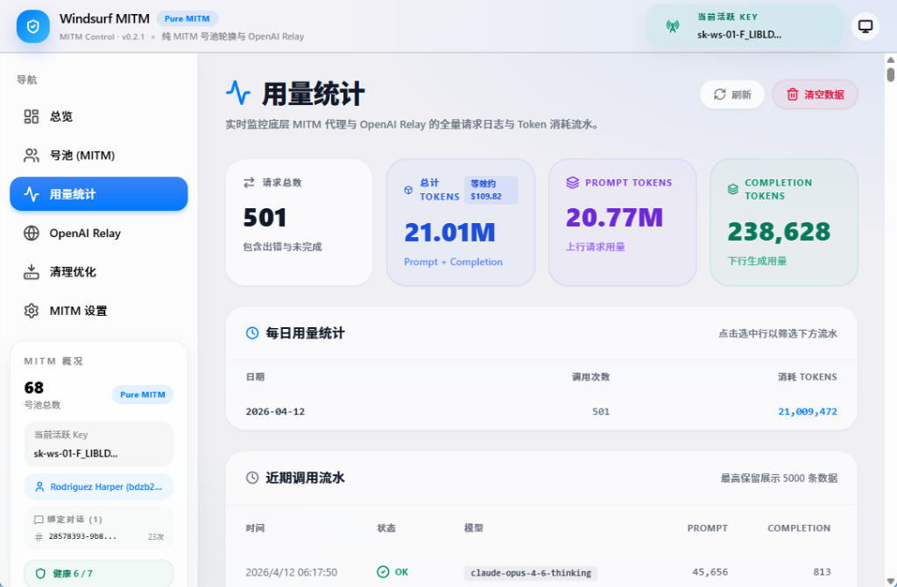
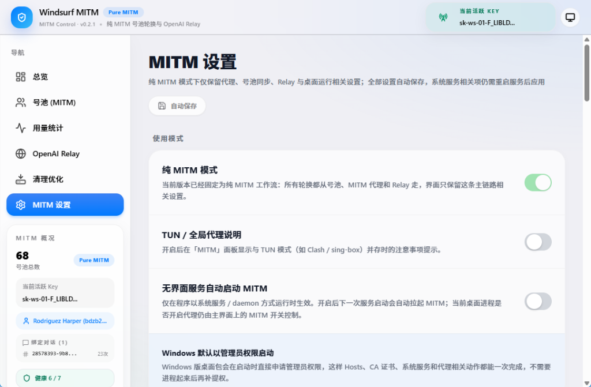
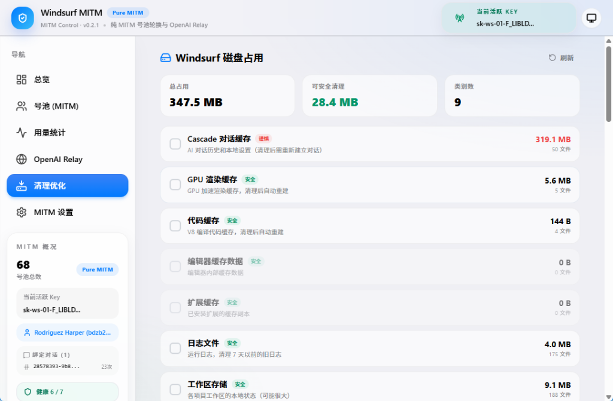

# Windsurf Tools 🏄‍♂️

[](https://github.com/shaoyu521/windsurf-Tools/releases)
[](#运行环境)
[](https://opensource.org/licenses/MIT)

**Windsurf Tools** is your ultimate desktop companion built using [Wails v2](https://wails.io/) (Go + Vue 3). It utilizes a seamless **Pure MITM Workflow** to automatically manage your Windsurf IDE accounts, execute invisible proxy rotation, synchronize quotas, and expose a blazing-fast local **OpenAI Relay API**!

> **EN:** *The ultimate Windsurf IDE companion: Seamless MITM proxy rotation, multi-account pool management, automated quota sync, and a built-in OpenAI compatible Relay server.*

**Windsurf Tools** 是一款基于 [Wails v2](https://wails.io/) (Go + Vue 3) 开发的生产力增强应用。当前版本产品形态深度聚焦于 **纯 MITM 工作流**，旨在为开发者提供全自动的平台代理打通、号池动态切换、用量实时刷新以及兼容全行业的 **本地 OpenAI Relay 中转服务**。告别繁琐的手动编辑与封号焦虑！

> **ZH:** *Windsurf 无感切号与号池管理神器：纯 MITM 无缝切号、细粒度多账号额度同步、以及本地原生 OpenAI 兼容接口。*

## 💬 交流群

进不去群请加微信：**LinMuYang-i9**

| 1群 | 2群 | 3群 |
|-----|-----|-----|
|  |  |  |


---

## 💬 交流群 | Community

进不去群请加微信：**LinMuYang-i9**

| 1群 | 2群 | 3群 |
|:---:|:---:|:---:|
|  |  |  |

---

## 🎨 界面缩略与核心功能 | Features & Previews

#### 1. 代理核心与全局总览 (Dashboard)
直观的全局大盘！一眼确认纯 MITM 代理状态、健康度、号池总量与活跃的无感切割链路，以及中转大盘信息。

| 首页总览面板 |
| :---: |
|  |

#### 2. 号池统管全景 (Accounts)
动态跟踪 `Free / Trial / Pro / Max` 全序列套餐状况。无需登录浏览器，随时监控最新订阅边界、当前运行时见底（Runtime Exhausted）、历史用量以及池绑定状况。

| 账号与号池管理视图 |
| :---: |
|  |

#### 2. 本地 OpenAI API 兼容中转 (OpenAI Relay)
集成 SSE 流式输出能力。您可以将自己购买或获取到的账号无缝接入类似 `ChatGPT-Next-Web`, `LobeChat`, `Cursor`, 甚至 `OpenAI SDK` 客户端。后端自带健康检测与故障倒换，前端全UI掌控模型映射。

| OpenAI Relay 控制台 |
| :---: |
|  |

#### 3. 流量用量统计面板 (Usage & Diagnostics)
全新设计的 **Usage Dashboard** 精确计算并聚合从您机器发往 Windsurf / OpenAI 的全部流通 Token 的数量以及大略转换的美金价值，全方位杜绝隐藏费用，更有完整历史流水审计明细。

| 数据用量与流水洞察 |
| :---: |
|  |

#### 4. 高级抓包与环境调试引擎 (Advanced MITM Config)
强大的 MITM 号池设置机制！从会话固化（Session Binding）、静默截获到高能协议体 Protobuf 的深度解析与截流。更支持直接抓取原始流水（Dump），方便二次排查分析。

| 核心层代理与策略配置 |
| :---: |
|  |

#### 5. 垃圾与残留清道夫 (Clean-Up Optimizer)
不再让海量 Cascade AI 对话数据和渲染缓存吃掉你珍贵的硬盘空间！轻轻一点即可完成各环节的精简化部署清理，重获新生。

| 磁盘瘦身优化 |
| :---: |
|  |

> ⚠️ *声明：当前仓库内上述预览图均为最新桌面端界面的脱敏展示图。我们永远不会窃取并上传任何账号池数据，全部本地化存储于 `settings.json`与 `accounts.json`。*

---

## 📦 下载发布包 | Download Releases

每次推送 `v*` 标签后，GitHub Actions 会自动构建并发布以下产物到 [Releases](https://github.com/shaoyu521/windsurf-Tools/releases)：

| 文件 | 平台 | 说明 |
|------|------|------|
| `windsurf-tools-wails.exe` | Windows amd64 | 单文件，启动时默认请求管理员权限 |
| `windsurf-tools-wails-windows-amd64.zip` | Windows amd64 | Windows 单文件压缩包 |
| `windsurf-tools-wails-macos-intel-amd64.zip` | macOS Intel | 打包后的 `.app` 压缩包 |
| `windsurf-tools-wails-macos-apple-silicon-arm64.zip` | macOS Apple Silicon | 打包后的 `.app` 压缩包 |
| `SHA256SUMS.txt` | 全平台 | 所有发布文件的 SHA256 校验 |

> 本程序在 Windows 下默认请求管理员运行以实现完整的代理劫持（Hosts、CA安装配置）。请放心授予或采用受控模式运行。macOS 环境需要处理好初次的 Gatekeeper。

---

## 💻 运行环境 | Prerequisites 

### Windows
- Windows 10 / 11 `amd64` 
- [Microsoft Edge WebView2 Runtime](https://developer.microsoft.com/microsoft-edge/webview2/) 依赖

### macOS
- 支持 Intel (`amd64`) 及 Apple Silicon (`arm64`) 双架构。由于使用跨平台 Webview UI，苹果系统亦可享用统一的视觉体验。

---

## 🧰 从源码构建 | Build from Source

#### 前置条件
- [Go](https://go.dev/dl/) 1.24.x
- [Node.js](https://nodejs.org/) 20+
- [Wails CLI v2](https://wails.io/docs/gettingstarted/installation)

```bash
git clone https://github.com/shaoyu521/windsurf-Tools.git
cd windsurf-Tools

# 安装前端依赖
cd frontend
npm install
cd ..

# 编译应用 (默认输出在 build/bin/ 下)
wails build
```

---

## ⚙️ 系统集成：服务化运转模式

支持基于 [kardianos/service](https://github.com/kardianos/service) 的无 UI 后台服务模式（纯 Daemon），使得你的工作环境能持久享受 OpenAI 中继及 MITM 打通福利！

`windsurf-tools-wails.exe install/start/stop`

---

## 📁 隐私与数据目录 | Privacy

应用核心配置目录定位在标准用户持久化节点下：
- Windows: `%APPDATA%\WindsurfTools\`

内部保存 `accounts.json`、`settings.json` 及全套 MITM 证书。**请注意切勿向公共社区随意提交这部分文件以保护您的隐私泄漏！** 详见 [SECURITY.md](SECURITY.md)。

---

## 📄 开源许可 | License
[MIT License](LICENSE)
